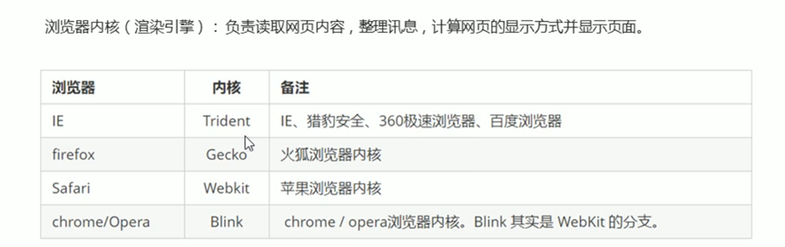
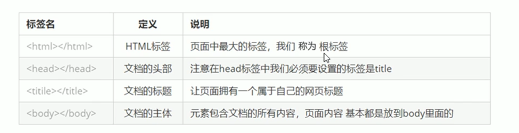
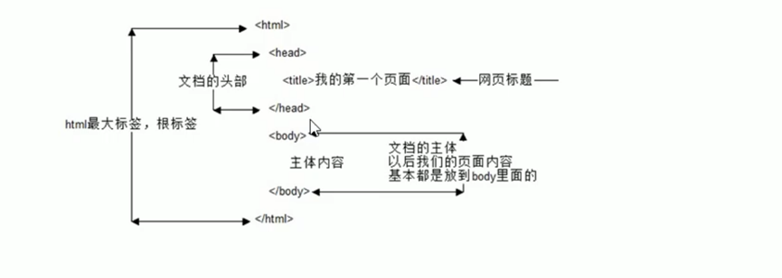

# HTML 超文本标记语言

网站：多个网页的集合，网页时构成网站的基本元素

网页：HTML

浏览器内核（渲染引擎）：负责读取网页内容，整理讯息，计算网页的现实方式并显示页面

国产浏览器用的Webkit or Blink 内核

### Web标准

由W3C组织和其他标准化组织制定的一系列标准的聚合。W3C（万维网联盟）

### Web标准构成

结构（HTML）

表现（CSS）

行为（JavaScript）

所有标签都写在<>中

开始标签<> 结束标签</> 

单标签< br/> 换行

包含关系

< head>  包含关系

​	< title> < /title> 

< head> 

< head> < /head> 并列关系

< body> < /body>

简单的html结构

< html>

​	< head>

​				< tltle> < /title>

​	</ head>

​	< body>

​	< body>

</ html/>

